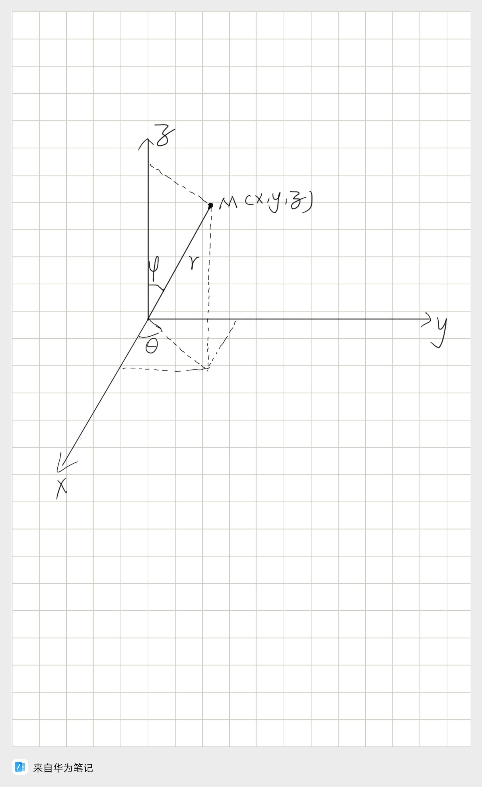

<head>
  
  
</head>

# 重积分

## 二重积分

### 性质：

1. $\iint _D[f(x,y) \pm g(x,y)]dxdy=\int \int _Df(x,y)dxdy+\int \int _Dg(x,y)dxdy$

2. $\int \int _Dkf(x,y)dxdy=k\int \int _Df(x,y)dxdy$

3. $D=D_1+D_2 \Rightarrow \int \int _{D_1}f(x,y)dxdy+\int \int _{D_2}f(x,y)dxdy$

4. $\int \int _Ddxdy=A,A$为$D$的面积

5. 在$D$上有$f(x,y)\leq g(x,y)$则$\int \int _Df(x,y)dxdy \leq \int \int _Dg(x,y)dxdy$,若$f(x)$不恒等于$g(x)$,则 $\int \int _Df(x,y)dxdy < \int \int _Dg(x,y)dxdy$

6. 对称性质：
  - 关于$x$轴对称时，一侧区域为$D_1$:
  
  $$\begin{cases}
    f(x,-y)=-f(x,y),\int \int _Df(x,y)dxdy=0\\
    f(x,-y)=f(x,y),\int \int _Df(x,y)dxdy=2\int \int _{D_1}f(x,y)dxdy
  \end{cases}$$

  - 关于$y$轴对称类似
  
  - 关于$y=x$对称：$\int \int _Df(x,y)dxdy=\int \int _Df(y,x)dxdy$
  
  - 关于$y=-x$对称：$\int \int _Df(x,y)dxdy=\int \int _Df(-y,-x)dxdy$

7. 中值定理：
   设$f(x,y)$在$D$上连续，$A$为$D$面积，则一定存在$(m,n) \in D$使$\int \int _D f(x,y)dxdy=f(m,n)A$
  
### 计算方法：
1. 直角坐标法
   
   $$\int \int _Df(x,y)d\alpha=\int^b_adx\int^{\phi _2(x)}_{\phi _1(x)}f(x,y)dy$$

    注意：以下情况积不了要改变积分次序

    $$\begin{cases}
    x^{2n}e^{\pm x^2}dx\\
    e^{\frac{k}{x}}dx\\
    cos\frac{k}{x}dx\\
    sin \frac{k}{x}dx
    \end{cases}$$

    8.1例题：$\int ^1_0dy\int_y^1 e^{x^2}dx$
    
    [答案](../pic/8.1.jpg)

2. 极坐标法（一般$D$或$f(x,y)$中包含$x^2+y^2$使用极坐标法）
   令$x=rcos\theta,y=rsin\theta,\rightarrow d\alpha=rdrd\theta$
   
    8.2例题$D:x^2+y^2\leq2x,$求$\int \int_D x^2+xy d\alpha$

    [答案](../pic/8.2.jpg)

## 三重积分

### 性质：
1. $\int \int \int _{\Omega}1dv=v$
2. 对称性与二重积分基本一样

### 计算方法：
1. 铅直投影法：
  
  $$\iiint _{\Omega}f(x,y,z)dv=\int \int _{D_{xy}}dxdy\int^{\phi_2(x,y)}_{\phi_1(x,y)}f(x,y,z)dz$$

2. 切片法：

    $$\int \int \int _{\Omega}f(x,y,z)dv=\int ^c_ddz\int \int _{D_z}f(x,y,z)dxdy$$

    8.3例题：$I=\int\int\int_{\Omega}\sqrt{x^2+y^2}dv,x^2+y^2+z^2\leq4$

    [答案](../pic/8.4.jpg)

3. 球面坐标变化法
    见图变换：

    

    $$\begin{cases}
    x=rsin\phi cos\theta\\
    y=rsin\phi sin\theta\\
    z=rcos\phi\\
    dxdydz=r^2sin\phi drd\theta d\phi
    \end{cases}$$
  
    8.4例题：$I=\int \int \int _{\Omega}zdv,\Omega:x^2+y^2+(z-2)^2 \leq 4$
  
    [答案](../pic/8.5.jpg)

